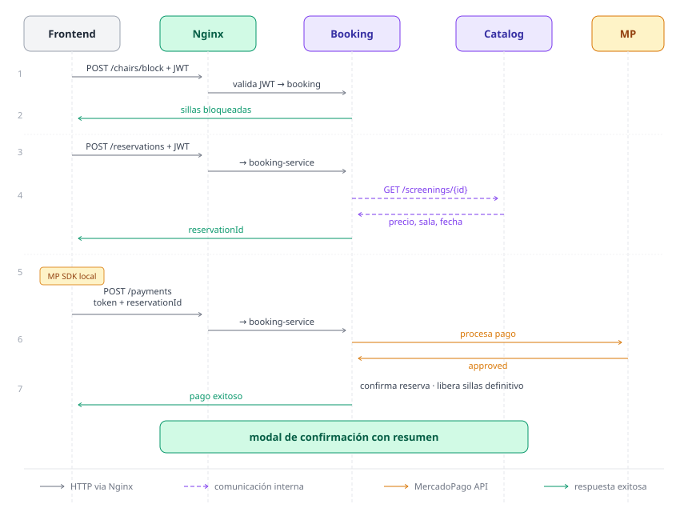

# 🎬 CinePop — Backend Microservicios

Backend de una plataforma de reservas de cine construido con arquitectura de microservicios.
Cada servicio es independiente, tiene su propia base de datos y se comunica a través de un API Gateway en Nginx.

## Arquitectura




El sistema está compuesto por 3 microservicios:

- **auth-service** — Registro, login y generación de JWT
- **catalog-service** — Gestión de películas y funciones con paginación
- **booking-service** — Reservas de sillas y procesamiento de pagos con MercadoPago

El tráfico entre el frontend y los servicios pasa por **Nginx** como API Gateway.

## Stack tecnológico

- **Java 21** + **Spring Boot 3**
- **Spring Security** con autenticación stateless por **JWT**
- **Spring Data JPA** + **PostgreSQL** (base de datos independiente por servicio)
- **MercadoPago SDK** para procesamiento de pagos
- **Docker** + **Docker Compose** para orquestación
- **Nginx** como API Gateway

## Flujo de microservicios




## Cómo correrlo localmente

### Requisitos
- Docker y Docker Compose instalados

### Pasos

```bash
git clone https://github.com/dast11lp/cinema-microservicios-backend-spring-boot.git
cd cinema-microservicios-backend-spring-boot
docker-compose up --build
```

Los servicios quedan disponibles en:

| Servicio | Puerto |
|----------|--------|
| API Gateway (Nginx) | http://localhost:80 |
| Auth Service | http://localhost:8081 |
| Catalog Service | http://localhost:8082 |
| Booking Service | http://localhost:8083 |

## Endpoints principales

### Auth
| Método | Ruta | Descripción |
|--------|------|-------------|
| POST | /auth/register | Registro de usuario |
| POST | /auth/login | Login y generación de JWT |

### Catálogo
| Método | Ruta | Descripción |
|--------|------|-------------|
| GET | /movies/list?page=0&size=6 | Listado paginado de películas |
| GET | /screenings/{movieId} | Funciones por película |

### Reservas
| Método | Ruta | Descripción |
|--------|------|-------------|
| GET | /chairs/{screeningId} | Sillas disponibles |
| POST | /reservations | Crear reserva |
| POST | /payments | Procesar pago con MercadoPago |

## Frontend

El frontend en React está disponible en:
[github.com/dast11lp/cinePop-React](https://github.com/dast11lp/cinePop-React)

---

Desarrollado por Daniel — Ingeniero de Sistemas
